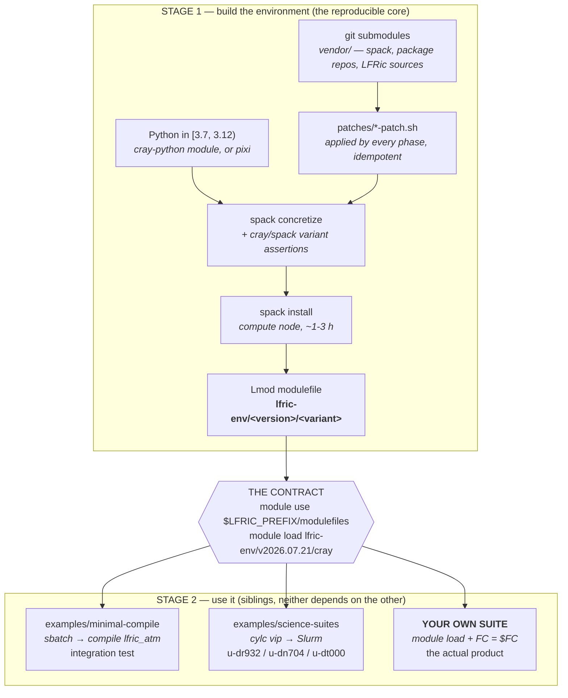
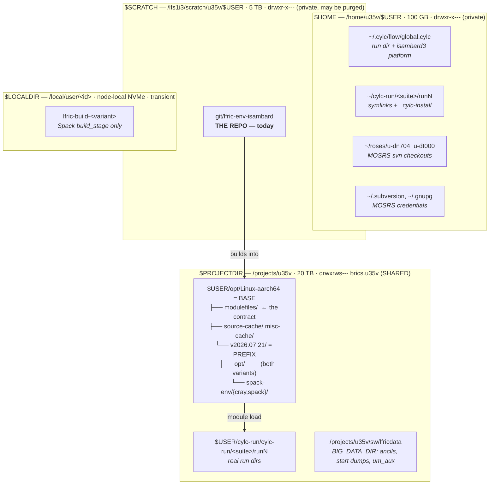

# PLAN — orientation for the refactor

> **Status, 2026-08-17.** The first half of this plan is done: Stage 1 has been
> extracted into a self-contained `stage1/` directory (its own submodules, its own
> `VERSION`, pixi mandatory there and nowhere else) and documented in
> `stage1/README.md`. That closed **R2** (the repo now lives under `$PROJECTDIR`),
> the modulefile half of **R3** (`lfric-env.lua` no longer sets `APPS_ROOT_DIR` /
> `CORE_ROOT_DIR` — §6's leak), and most of **R8** for the Stage-1 documentation.
> **R1, R4, R5, R6** and the Stage-2 side of **R3** and **R7** are untouched, and
> the sections below still describe the examples accurately. The examples
> themselves have not been ported: they still work, still read the root
> `scripts/common.sh`, and are the next piece of work.

**What this is.** A high-level, current-state map of the repo written to be the base
for a refactoring plan: how the workflow actually runs, where every byte lands on
disk, what the `module load` contract really covers, what writes to `$HOME`, the
documentation inconsistencies found in a sweep, and the resulting TODO list.

The TODO list (§9) records *problems and the option space*, deliberately not chosen
solutions — the refactor is not designed yet. §6 is the exception in weight rather than
in kind: it is the one item with a reproduced, user-visible failure behind it.

It replaces the previous PLAN.md ("Stage-3 follow-ups"), which was legacy: every
follow-up in it was marked DONE or SUPERSEDED, and its branch (`stage3-science-suites`,
PR #8) has long since merged — the newest ancestor is PR #15. Nothing was lost; the
facts it recorded live in `MAINTAINER.md` and the per-suite READMEs.

Deep rationale still lives in [`MAINTAINER.md`](MAINTAINER.md); end-user steps in
[`README.md`](README.md). This file is the *shape* of the thing, not a replacement
for either.

---

## 1. The shape in one picture



The single most important structural fact: **`examples/` is not a layer.** Nothing in
Stage 2 is a prerequisite for anything else. minimal-compile and science-suites are
integration tests that prove a bare `module load` is a sufficient toolchain, plus
adaptation templates. The product handed to a scientist is the modulefile.

That last claim is the one the rest of this document tests hardest, and §6 shows it does
not currently hold for a science suite: `examples/science-suites/site/activate-env.sh`
does work that a bare `module load` does not, and some of that work exists to undo the
modulefile. Read the diagram's `CONTRACT` box as the intent, not the status quo.

---

## 2. Stage 1 — your model, corrected

> **bootstrap Python with pixi (and except this pixi is completely optional)**

**Half right, and the emphasis is inverted.** The *constraint* is real and is the point:
Spack 1.0 parses sources with `ast.Str`, removed in CPython 3.12, so Spack must run
under Python **≥3.7, <3.12**. `lfric_check_python` (`scripts/lib.sh`) enforces it and
`common.sh` pins `SPACK_PYTHON` to whatever `python3` is on `PATH`.

But the **default** path is not pixi — `scripts/build.sbatch` does
`module load cray-python/3.11.7`. pixi is the *alternative*: it supplies a conda
Python 3.11 and task shortcuts, and every `pixi run` auto-sources `common.sh` +
`activate.sh`. The docs are deliberately no-pixi-first and every pixi task is a 1:1
wrapper around a `scripts/` script. So: pixi is optional *and* not the primary route.

> **With that python, bootstrap Spack**

**Spack is not bootstrapped, it is vendored.** `vendor/spack` is a pinned submodule
(`v1.2.2`); `common.sh` puts `$SPACK_ROOT/bin` on `PATH` and `lfric_bootstrap_spack`
just sources `share/spack/setup-env.sh`. Nothing is downloaded to *get* Spack.

Spack does do its own internal bootstrap (clingo, gnupg) on first solve — that
**does** hit the network, and it lands in `$PREFIX/spack-cache`, because the build
redirects `SPACK_USER_CONFIG_PATH`/`SPACK_USER_CACHE_PATH` under `PREFIX` so it never
reads or writes `~/.spack`. Worth knowing for the offline question below.

> **Everything we need over the network is git-submodule based, so a recursive init
> gets all we need**

**Not true, and this is the gap you already sensed.** Submodules cover three classes:
build tooling (`spack`, `spack-packages`, `mo-spack-packages`), the six LFRic source
repos (`lfric_apps`, `lfric_core`, `physics/{casim,jules,socrates,ukca}`), and one
science suite (`lfric_egp_bench`). They do **not** cover the ~hundreds of *Spack
package* sources — XIOS (a git clone from `gitlab.in2p3.fr`, the flakiest host in the
stack), mpich, hdf5, netcdf, python, node-js, rust, and so on. Those are fetched by
`spack install` at build time.

> **the compute node that compiles Stage 1 would still have network requests… if
> there's a way to fetch all sources first and we haven't used them, we should**

**It already exists and you are already using it — it is just optional and not
wired in.** `scripts/fetch.sh` (`pixi run fetch`) runs
`clone_missing_submodules → prepare → concretize → spack fetch` on the **login node**,
downloading every from-source package into the shared, content-addressed
`$BASE/source-cache`. It shares the `prepare`+`concretize` phases with `build.sh`, so
it provably warms the cache for the *same* solve. The subsequent `sbatch` then
installs from a warm cache.

What is missing is not the mechanism but the **guarantee**: `build.sbatch` does not
run it, nothing asserts the build stayed offline, and Spack's own clingo bootstrap is
outside `spack fetch`'s scope. That is TODO **R1** below — it is a hardening job, not
a new feature.

> **then we have patch mechanism to apply any necessary patch first**

**Right, with one structural detail worth carrying into the refactor.** Patching is
*inside* `lfric_prepare`, so `build.sh`, `concretize.sh` and `fetch.sh` all apply
patches automatically — there is no "forgot to patch" state. `patch-all.sh` is
`-maxdepth 1`, and there are two subdirectories deliberately outside that stack:

```
patches/                      applied by patch-all.sh, sorted, idempotent
  10,11-lfric_core-*          Fortran/Make fixes           → upstream: Met Office
  20,21,22-spack-packages-*   papi/gdbm build fixes        → upstream: Spack
  30-lfric_apps-local-sources reproducible/offline sources → ours, structural
  31-lfric_apps-slow-physics  vn3.2 forcing-only regression→ upstream: Met Office
  40-lfric_egp_bench-*        u-dr932 site diff            → upstream: Denis Sergeev
  suites/                     OUTSIDE — stagers for the MOSRS checkouts in $HOME
    41-roses-u-u-dt000-*      u-dt000 site diff            → upstream: MOSRS
    42-roses-u-u-dn704-*      u-dn704 site diff            → upstream: MOSRS
  optional/                   OUTSIDE — a suite opts in by path from its extract task
    32-lfric_apps-ice-giants  Denis's vn3.0 branch forward-ported to vn3.2
```

`patches/suites/` is out because it rewrites a checkout in the user's `$HOME`, which
an environment build must never do. `patches/optional/` is out because
`32-*` adds `compulsory=true` rose-meta items that would invalidate every *other*
suite's namelists.

> **then submit a batch script to a compute node to build the environment, with a
> few variants**

**Right.** Two variants, `LFRIC_STACK=cray|spack`, and they **share one install tree**
(`$PREFIX/opt`) — Spack's content-addressed store builds the big MPI-independent
subtree (python/rose/cylc/psyclone/…) once, and only the MPI-dependent part
(mpi, hdf5, netcdf, yaxt, xios, shumlib, lfric) twice. Compute node is mandatory
(login nodes cap `ulimit -u` ≈ 900); concretize and fetch are fine on a login node.

The variants are not equal partners:

| | `cray` (default) | `spack` |
|---|---|---|
| MPI | system cray-mpich + system libfabric (`cxi`) | from-source mpich, `ch4:ofi`, no `cxi` |
| Parallel I/O | Cray HDF5/netCDF externals | from-source |
| Launcher | `srun` (Cray PMI) | Hydra `mpiexec` (built `~slurm`) |
| Reality | **everything real runs here** | single-node/TCP portable fallback |

`spack` exists to keep the build honest and portable — it is what the build-invariant
exercises, not what anyone runs.

**The invariant, unchanged:** all four cases must build —
{Stage 1, minimal-compile} × {`cray`, `spack`}. The `lfric_assert_variant` grep over
`spack.lock` is what stops a leaking `PrgEnv` silently producing the wrong stack.

> **that should have created a modulefile; the contract is a few lines to module
> load, and the scientist is armed for Stage 2**

**Right in spirit — with a caveat that matters a lot for your PROJECTDIR question.**
See §5. The modulefile is two-part on purpose: version-controlled *logic*
(`scripts/lfric-env.lua`, snapshotted to `$BASE/modulefiles/lfric-env.lua`) plus a
generated per-build *data table* (`$BASE/modulefiles/lfric-env/<version>/<variant>.lua`).
Loading it sets `FC`/`CXX`/`LDMPI`/`FPP`, `FFLAGS`/`LDFLAGS` for the view,
`PATH`/`PYTHONPATH`/`SHUMLIB_ROOT`/`LD_LIBRARY_PATH`/`SPACK_ENV`, and — cray only —
`load()`s `PrgEnv-gnu` + the Cray HDF5/netCDF modules.

---

## 3. Stage 2 — your model, corrected


> **user sets up their cylc/rose thing to essentially bake in the module load**

**Right, and that is the whole of it.** Concretely: source an `ACTIVATE_ENV` script
from the suite's root `init-script` and the platform `pre-script`, then write
`FC = $FC` / `LDMPI = $LDMPI` / `FPP = $FPP` instead of a literal compiler. The one
trap is that upstream Met Office EX suites *hard-code* `FC = mpif90`, which overrides
the module's `ftn` and breaks the cray build.

**But "bake in the module load" is harder than it sounds, and this is where the contract
actually leaks** — there is no hook in a cylc job that is both early enough to put
`cylc`/`rose` on `PATH` and late enough to leave the suite's own `[[[environment]]]`
alone. §6 works this through, with the user-visible failure it caused.

> **user submits their workflows as usual — compile first, then run**

**Right.** Note the scheduler is a long-lived login-node process that submits each
task to Slurm itself; `sbatch`-ing the scheduler is the classic mistake, and
`run-suite.sh` is deliberately *not* an sbatch wrapper.

> **I don't understand the patches. We still have patches here, meaning users can't
> be business as usual.**

**This is the sharpest observation in your list, and the answer is: three different
patch families are being conflated, and only one of them is a real tax on an
end user.**

| Family | Applies to | Who bears it | Upstream target |
|---|---|---|---|
| **(a) LFRic source** — `patches/{10,11,30,31}` via `site/patch-sources.sh` | the tree the extract task just cloned | **every** suite, including a stranger's | Met Office `lfric_core` / `lfric_apps` |
| **(b) suite site diffs** — `40-*`, `suites/{41,42}-*` | *our three example suites only* | nobody else | Denis (u-dr932); MOSRS ticket (u-dn704, u-dt000) |
| **(c) opt-in science** — `optional/32-*` | u-dt000's extract only | nobody else | Denis, when he rebases `ice_giants_tf` |

So a scientist bringing their own suite inherits **only family (a)** — and of those,
`30-lfric_apps-local-sources` is structural to Stage 1 (it is what makes the
minimal-compile build offline and reproducible) and arguably should *not* be applied
on the suite path at all, where the extract clones legitimately. `10`, `11` and `31`
are genuine upstream fixes with a clean path to the Met Office.

Family (b) is not a tax at all — it is the *product* of the porting work. Each is a
real reviewable diff against a real upstream, which is exactly the design goal ("never
copy the suite in"). It shrinks as upstream absorbs it: u-dr932's lost 40 lines the
day Denis merged the placement fix, and u-dn704 lost its entire `rose app-upgrade`
step when the Met Office took the suite to vn3.2 themselves.

Your two TODOs are right, and become **R5** and **R6**. R6 in particular is the
missing piece of the product: a *"port your suite to Isambard 3"* guide. Everything
needed for it already exists as prose scattered across
`examples/science-suites/README.md` ("Adapting this for your own suite", the
placement contract) and the top-level README ("Run your own science suite") — it needs
extracting, generalising and de-exampling, not writing from scratch.

---

## 4. Where everything actually lives



The `PREFIX` / `BASE` / `WORKING_DIR` split is deliberate and worth preserving:

- **`BASE`** (`LFRIC_PREFIX`) — per-arch, **shared across env versions**. Holds
  `modulefiles/` (one `module use`, `module avail lfric-env` lists every
  version × variant) and the content-addressed download caches, so a new version
  reuses already-downloaded sources instead of re-hitting `gitlab.in2p3.fr`.
- **`PREFIX`** = `$BASE/$LFRIC_ENV_VERSION` — persistent, per-version. A rebuild
  lands in a fresh tree instead of overwriting an env someone is loading right now.
  Version is a plain read of the committed `./VERSION` (CalVer), bumped deliberately.
- **`WORKING_DIR`** — transient Spack `build_stage` *only*, pointed at node-local NVMe
  because it is metadata-heavy and contended Lustre makes the install phase crawl.

### Filesystem quirks found while mapping this

- **`~/cylc-run/…` is a doubled path.** `setup-cylc.sh` sets
  `[install][symlink dirs] run = $PROJECTDIR/$USER/cylc-run`, and cylc *appends*
  `cylc-run/<workflow_id>` to that, producing
  `/projects/u35v/$USER/cylc-run/cylc-run/u-dn704/run5`. Cosmetic, but it is real and
  it is in every log path. Fix is one word: `run = $PROJECTDIR/$USER`. **R8.**
- **Stale unversioned modulefiles** survive in `$BASE/modulefiles/lfric-env/{cray,spack}.lua`
  from before the version keying. Harmless, confusing. **R8.**

---

## 5. Does loading the env need this repo? — the honest answer

The docs say, repeatedly and unqualified, *"the repo can move or be deleted and
`module load` still works."* **That is true for compiling and running, and false for
everything else.** I read the generated modulefile and the instantiated Spack manifest
to check.

**Self-contained (all under `$BASE`, no repo needed):**
`PATH`, `PYTHONPATH`, `CYLC_PYTHONPATH`, `ROSE_PYTHONPATH`, `LD_LIBRARY_PATH`,
`LIBRARY_PATH`, `FFLAGS`, `LDFLAGS`, `FC`/`CXX`/`LDMPI`/`FPP`, `SHUMLIB_ROOT`,
`PSYCLONE_CONFIG`, the Cray PE `load()`s, and the logic snapshot
`$BASE/modulefiles/lfric-env.lua`. **A scientist who only compiles and runs is fine.**

**Baked-in paths that point back into the repo:**

1. `APPS_ROOT_DIR` → `$REPO/vendor/lfric_apps` and `CORE_ROOT_DIR` → `$REPO/vendor/lfric_core`
   (`scripts/lfric-env.lua:171-172`). A minimal-compile convenience. A science-suite
   deliberately *overrides* these back to its own extracted tree
   (`site/activate-env.sh` saves and restores them across the module load) — which is
   evidence they should not be in the modulefile at all.
2. `SPACK_ENV` → `$PREFIX/spack-env/<variant>`, whose generated `spack.yaml` carries
   `include: /lfs1i3/scratch/u35v/khcheung.u35v/git/lfric-env-isambard/spack-env/common.yaml`,
   whose `repos:` are relative → `$REPO/spack-repo/lfric-isambard`,
   `$REPO/vendor/mo-spack-packages/…`, `$REPO/vendor/spack-packages/…`.
   **So any `spack` command against the loaded env needs the repo readable.**
3. `repo_root` and the `help()` text (cosmetic).

**And the repo is currently unreachable to your collaborators.**
`/lfs1i3/scratch/u35v/khcheung.u35v` is `drwxr-x---` owned by group `khcheung.u35v`
— a personal group. `$PROJECTDIR/$USER/opt/…` is `drwxr-sr-x`, group `brics.u35v`,
under a `drwxrws--- brics.u35v` parent. So today, a `brics.u35v` colleague can
`module load` and compile and run — but `spack find` errors, `APPS_ROOT_DIR` dangles,
and nothing under `examples/` or `patches/` is reachable, so they cannot run a
science suite at all.

**Verdict on your instinct: move the repo to `$PROJECTDIR`.** It is the right call and
it is cheap. What it costs (**R2**):

- Re-instantiate the Spack manifest so the `include:` points at the new path — a
  login-node `bash scripts/concretize.sh` does exactly this via `lfric_instantiate_env`
  (idempotent; the solve is a ~1 s no-op when the lock already matches).
- Re-run `bash scripts/gen-modulefile.sh` (standalone, no rebuild) so `repo_root` /
  `APPS_ROOT_DIR` / `CORE_ROOT_DIR` follow — with the Cray PE modules loaded, for
  `CRAY_LD_LIBRARY_PATH`. Repeat for `LFRIC_STACK=spack`.
- Group-readability: `$PROJECTDIR/$USER` is already `drwxr-sr-x` + setgid, so a plain
  `git clone` under it inherits `brics.u35v`. Check `umask` gives group `r-x`.

Worth doing *as part of* the refactor rather than before it, because the refactor
should also decide whether goals 1 and 2 above are bugs — a fully repo-independent
runtime contract is achievable (vendor `common.yaml` + the three package repos into
`$PREFIX`, drop `APPS_ROOT_DIR`/`CORE_ROOT_DIR` from the modulefile) and would make
the "where does the repo live" question stop mattering. **R3.**

---

## 6. The `module load` contract — where it leaks, with field evidence

Everywhere in this repo the contract is stated as: *`module load
lfric-env/<version>/<variant>` and then carry on as usual.* On 2026-08-13 the first
external user (Denis, u-dr932) tried exactly that and the build died. The failure is
worth recording in full, because the interesting part is not the error — it is that
the error falsifies the contract as stated.

### 6.1 What happened

```
Makefile:68: /lfs1i3/scratch/u35v/khcheung.u35v/git/lfric-env-isambard/vendor/lfric_core/infrastructure/build/lfric.mk: Permission denied
make: *** No rule to make target '.../vendor/lfric_core/infrastructure/build/lfric.mk'.  Stop.
```

The chain, verified against the installed artefacts rather than the sources:

1. `$BASE/modulefiles/lfric-env.lua:171-172` (the logic snapshot; source is
   `scripts/lfric-env.lua`) does
   `setenv("CORE_ROOT_DIR", repo .. "/vendor/lfric_core")`, with
   `repo_root = "/lfs1i3/scratch/u35v/khcheung.u35v/git/lfric-env-isambard"` baked into
   `v2026.07.21/cray.lua:10`.
2. `lfric_apps/applications/lfric_atm/Makefile` does
   `include $(CORE_ROOT_DIR)/infrastructure/build/lfric.mk`.
3. Concatenating 1 and 2 reproduces the error path character for character. Nothing
   else on the machine sets that variable to that value.

**The "Permission denied" is a red herring that happens to be load-bearing.**
`lfric.mk` is `-rw-r--r--` and every directory from `git/` down is `drwxr-xr-x`.
Exactly one directory blocks: `/lfs1i3/scratch/u35v/khcheung.u35v` is `drwxr-x---`
owned by group `khcheung.u35v` — a *personal* group (§5). A `brics.u35v` colleague
gets through `/lfs1i3/scratch/u35v` (0750 `root:brics.u35v`) and stops there, so the
traversal returns `EACCES` and make reports it against the leaf.

Had the path been readable, the build would have **succeeded** — against *our* pinned
`vendor/lfric_apps` + `vendor/lfric_core` plus our patch stack, instead of the tree his
own extract task had just produced from his own `dependencies.yaml`. Two source trees
mixed: duplicate PSyclone kernels, version-skewed `.mod` files, a binary that
corresponds to no declared source revision. The permission wall converted a silent
wrong build into a loud failure. That is luck, not design.

### 6.2 Why this is a contract problem, not a permissions problem

**The modulefile is not additive.** It `setenv`s four variables that a science suite
*owns*: `APPS_ROOT_DIR`, `CORE_ROOT_DIR`, `LFRIC_TARGET_PLATFORM`, `FPP`. Loading the
module is therefore not a neutral act — it silently reroutes where a suite's build
finds its sources.

**And cylc's phase order means a suite cannot defend itself.** Verified in the
installed cylc 8.4.2 (`cylc/flow/etc/job.sh:41,177`), the job runs:

```
init-script  →  cylc env  →  env-script  →  user_env  →  pre-script  →  script
```

`user_env` is the suite's `[[[environment]]]` block, where u-dr932 declares
`CORE_ROOT_DIR = $SOURCE_ROOT/lfric_core` (upstream, unmodified — confirmed against
`git show HEAD:` on the unpatched submodule). `pre-script` runs **after** it. So any
activation that loads the module in a pre-script overrides the suite, and the order is
fixed by cylc — the suite author cannot reorder it.

Nor can the load simply move earlier. It has to be early enough that `cylc` and `rose`
are on `PATH` before cylc's first `cylc message` and before `env-script`'s
`rose task-env` (otherwise the job dies `exit 127` before any pre-script runs — the
reason `flow.cylc:111-129` loads it in `init-script` at all), *and* late enough not to
stamp on `user_env`. **No single hook satisfies both.** Our port loads it in both
places and then undoes the damage by hand.

**`site/activate-env.sh:65-75` is that undo** — it saves the four variables, loads the
module, and restores them. Read plainly: it is a workaround for our own modulefile,
not a service to the suite. And because the workaround lives in *our* file rather than
in the module, a user who follows the documented contract and writes their own two-line
activator inherits the defect. That is precisely what happened here.

**Your reading is right.** If the contract only holds when the user activates through
`activate-env.sh`, then the contract is not `module load` — it is `module load` *plus
our activator*, and "business as usual" is overstated.

### 6.3 What `module load` does not cover today

Auditing `site/activate-env.sh` for everything it does beyond `module load`, and what
kind of thing each is:

| What it does | Kind |
|---|---|
| save/restore `APPS_ROOT_DIR` / `CORE_ROOT_DIR` / `LFRIC_TARGET_PLATFORM` / `FPP` | **defect workaround** (§6.2) |
| `ROSE_SITE_CONF_PATH` → `site/rose.conf`, the `[rosie-id]` `u-` prefix map | genuine site fact, additive |
| `HDF5_USE_FILE_LOCKING=FALSE` (Lustre rejects `flock()`; XIOS writes 0-byte output) | genuine site fact, additive |
| source Lmod init for a clean `bash -l` job shell | glue |
| sources `scripts/common.sh` — **so the activator needs the repo** — then saves and restores `WORKING_DIR` because `common.sh` forces it to Stage 1's shared stage | second-order symptom |

The last row is its own small indictment: a "thin activator" that requires the repo on
disk and then has to undo a side effect of the file it just sourced is not thin. The
two middle rows are defensible as facts about *this machine* that a modulefile could
just as well carry — they are additive, so nothing breaks either way, but they are
things the user must currently *know*.

So the honest statement of the contract as it stands is: **`module load`, plus two
site facts, plus a defensive save/restore, plus Lmod glue.** Whether the right response
is to shrink the modulefile, grow it, or split it is open — see R3, deliberately left
without a chosen answer.

### 6.4 A second, independent finding from the same report

Denis also removed `platform = 'uoe-isambard3'` from his `flow.cylc` because it errored
with *unknown platform* — that platform is defined in Edinburgh's `global.cylc`, which
he does not have. Removing the line does not disable platform selection; it falls back
to `platform = localhost`, i.e. **every task becomes a background process on the login
node**. An LFRic compile there hits `ulimit -u` (~900 procs) and dies `fork: Resource
temporarily unavailable`, and a run task would execute the model on the login node with
no Slurm, no `srun`, no Slingshot.

He had no way to know. The `isambard3` platform exists only because
`scripts/setup-cylc.sh` writes it into `~/.cylc`, and he had not run it — nothing in a
bare `module load` reveals that a platform is required, or what it is called. This is
the same gap as §6.2 seen from the other side: the environment ships a toolchain but
not the site knowledge needed to use it.

### 6.5 `~/.cylc/flow/global.cylc` — how it actually gets there

**The answer to "remind me how a user sets this up":**

```bash
bash scripts/setup-cylc.sh          # or: pixi run setup-cylc
```

Idempotent, opt-in, and it is not part of building the environment (Stage 1 must not
touch `$HOME`). It creates `~/.cylc/flow/global.cylc` if absent and maintains two
*managed blocks* in it, delimited by `# BEGIN/END LFRIC_*` sentinels — replaced in
place if present, appended if not, so hand-written config around them survives:

```cylc
# BEGIN LFRIC_CYLC_RUN_DIR
[install]
    [[symlink dirs]]
        [[[localhost]]]
            run = $PROJECTDIR/$USER/cylc-run      # ← the doubling bug, R8
# END LFRIC_CYLC_RUN_DIR

# BEGIN LFRIC_ISAMBARD3_PLATFORM
[platforms]
    [[isambard3]]
        hosts = localhost
        job runner = slurm
        install target = localhost
# END LFRIC_ISAMBARD3_PLATFORM
```

Nobody following the documented science-suite path runs it by hand:
`examples/science-suites/run-suite.sh:116` invokes it before `cylc vip`. It is
documented at `README.md:165` and `examples/science-suites/README.md:348`.

The platform block **must** live in `global.cylc` itself, not in
`~/.cylc/flow/platforms.d/`: the drop-in directory is only read by cylc ≥ 8.5 and the
environment ships 8.4.2. `setup-cylc.sh` deletes a stale `platforms.d/isambard3.cylc`
left by older revisions of itself — which is why its own header comment, still
advertising that it *writes* that file, is wrong (R8, §8 item).

**Your judgement — mandatory but one-time, therefore probably fine — is reasonable,
and there is a sharper way to put the smell.** What is in that file is not user
preference; it is two *facts about Isambard 3*. Cylc's own hierarchy is
`$CYLC_SITE_CONF_PATH/flow/<ver>/global.cylc` (default `/etc/cylc`) → then the user's,
user overriding. So this is site config that we currently write into every user's home
directory, one user at a time.

**On upstreaming it:** not to the Met Office — Isambard 3 is not an MO machine, and
their site config describes theirs. The two plausible homes are (i) a system-wide
`/etc/cylc/flow/` on Isambard 3, owned by BriCS, which would make the platform
available to every user of the machine whether or not they use this environment; or
(ii) shipped inside the environment under `$PREFIX` with `CYLC_SITE_CONF_PATH` exported
by the modulefile, which would fold it into the `module load` and keep it versioned
with the env (R4). They are not exclusive, and (i) is not ours to decide. Either way
the user's `~/.cylc` remains an override, so nobody loses control — which is the test
of whether a change is closer to business as usual or further from it.

---

## 7. What writes to `$HOME` — and how much of it is negotiable

Stage 1 touches `$HOME` **not at all**, by design: `SPACK_USER_CONFIG_PATH` and
`SPACK_USER_CACHE_PATH` are redirected under `PREFIX`, so not even `~/.spack` appears.
Everything below is Stage 2. Verified against the installed cylc 8.4.2 / rose 2.4.2.

| Path | Written by | Configurable? | Moving it breaks "business as usual"? |
|---|---|---|---|
| `~/.cylc/flow/global.cylc` | `scripts/setup-cylc.sh` | **Yes** — `CYLC_CONF_PATH` (user config dir) or `CYLC_SITE_CONF_PATH` (site config, default `/etc/cylc`) | **No — and there is an upgrade here.** See below. |
| `~/cylc-run/<suite>/runN` | cylc itself | **Only partly.** `_CYLC_RUN_DIR = $HOME/cylc-run` is **hardcoded** in `cylc/flow/pathutil.py`. `[install][symlink dirs]` is the supported redirect and we already use the maximal form (`run`), so what remains in `$HOME` is a symlink + `_cylc-install/` per run — bytes, not data. | **Yes, if forced further.** Overriding `$HOME` is the only other lever and is a blunt hammer. |
| `~/roses/<suite>` | `rosie checkout` (u-dn704, u-dt000) | **Yes** — `[rosie-id] local-copy-root` in a `rose.conf`, and we already ship one via `ROSE_SITE_CONF_PATH` (`site/rose.conf`, for the `u-` prefix map). `run-suite.sh` also honours `LFRIC_SUITE_DIR`. | **Mildly.** `~/roses` is a strong Met Office habit; `rosie checkout` printing a different path is a small surprise. |
| `~/.metomi/rose.conf` | rose user config (not written by us) | **Yes** — `ROSE_CONF_PATH` / `ROSE_SITE_CONF_PATH` | n/a — we don't write it |
| `~/.subversion`, `~/.gnupg` | svn / gpg-agent for MOSRS auth | System-standard, effectively no | n/a — user's own credential store |

**Neither cylc nor rose implements XDG.** I grepped both installed packages for
`XDG_CONFIG_HOME` / `XDG_DATA_HOME`: zero hits. cylc hardcodes `~/.cylc/flow` (via
`os.getenv('HOME')`) and rose hardcodes `~/.metomi`. So "make them respect XDG" is not
a configuration option — it would be an upstream feature request. Not worth pursuing.

**The interesting finding is `CYLC_SITE_CONF_PATH`.** cylc's config hierarchy is
`$CYLC_SITE_CONF_PATH/flow/<ver>/global.cylc` → `~/.cylc/flow/<ver>/global.cylc`, site
first, user overriding. That means the `isambard3` Slurm platform and the run-dir
redirect could ship **inside the environment** — written into `$PREFIX` at build time
and `setenv CYLC_SITE_CONF_PATH` from the modulefile — instead of being poked into
every user's `$HOME` by an opt-in script. Users would then need **zero** `~/.cylc`
setup, could still override anything in their own `~/.cylc`, and `setup-cylc.sh`
would become a fallback rather than a step. That is strictly *more* business-as-usual,
not less: a site config is exactly what a Met Office user's workstation already has.
**R4** — and I think it is the single highest-value item on this list after R1.

---

## 8. Documentation inconsistencies found

A sweep of every `*.md` plus the comment headers in `scripts/`, `examples/`,
`patches/` and `pixi.toml`. None of these are load-bearing; they are drift, and the
refactor is the moment to clear them.

**Wrong facts (would mislead a reader):**

1. `README.md:171` — calls the physics submodules "**Stage-2** physics submodules
   (**private** Met Office repos — same SSH access as above)". Both halves are wrong,
   and the *same file* contradicts itself: Prerequisites (line 65-73) correctly says
   all six LFRic repos are public HTTPS and only `mo-spack-packages` is private, and
   `pixi.toml:44` says "All four are public — no credentials."
2. `scripts/setup-cylc.sh:5-8` — the header advertises writing
   `~/.cylc/flow/platforms.d/isambard3.cylc`. The body deliberately does **not**: cylc
   8.4.2 reads platforms only from `global.cylc`, and the script actively *deletes* a
   stale `platforms.d/isambard3.cylc`. The header describes behaviour that was
   removed. It also still calls minimal-compile "the bundled lfric_atm example".
3. `MAINTAINER.md:144-151`, `scripts/lfric-env.lua:4`, `scripts/common.sh:110`,
   `pixi.toml:19` — all say the modulefiles live at **`$PREFIX/modulefiles`**. They
   live at **`$BASE/modulefiles`** (version-independent, shared) and are keyed
   `lfric-env/<version>/<variant>.lua`, not `lfric-env/<variant>.lua`. `README.md` has
   this right. This one actually matters: `$PREFIX/modulefiles` does not exist.
4. `MAINTAINER.md:26`, `scripts/fetch.sh:7`, `pixi.toml:96` — say the download cache
   is `$PREFIX/source-cache`. It is `$BASE/source-cache`; sharing it across versions is
   the whole point, and `MAINTAINER.md:86` says so correctly 60 lines later.
5. `MAINTAINER.md:280-282` — "`unpatch.sh` reverts them all by `git reset --hard` on
   `lfric_core`, `lfric_apps`, and `spack-packages`". It resets **four** submodules;
   `lfric_egp_bench` is missing. `scripts/unpatch.sh:4` has the same off-by-one in
   prose ("three submodules") while its loop lists four.
6. `README.md:154-155` / `MAINTAINER.md:95-98` — "the repo can move or be deleted and
   `module load` still works", stated without qualification. Per §5 this holds for
   compile+run and fails for `spack` and `APPS_ROOT_DIR`/`CORE_ROOT_DIR`.

**Stale or incomplete (won't mislead, but rots):**

7. `MAINTAINER.md:27` — `activate.sh # module load lfric-env/<variant>`, missing the
   version component (same stale key as #3).
8. `MAINTAINER.md:262-282` (Patches) — documents `10/11`, `20/21/22`, `30`. Missing
   `31-lfric_apps-slow-physics-mphys-field` and `40-lfric_egp_bench-u-dr932`, both of
   which are load-bearing for the science suites.
9. `MAINTAINER.md:52-66` (layout tree) — `vendor/` omits `mirrors/` (the
   `MetOffice/<repo>.git` symlink farm that makes `USE_MIRRORS=true` work);
   `scripts/` omits `bump-env-version.sh`; `staging/` is absent entirely though
   `CLAUDE.md` documents it.
10. `pixi.toml:28` — cross-references a README section called "Architecture". No such
    heading exists (it is "The build, and two tiers of example").
11. `CLAUDE.md:19,22` / `README.md:171` — "Stage 2"/"Stage 3" survive as historical
    parentheses. Fine in `CLAUDE.md` (explicitly historical), stale in `README.md`.
12. `MAINTAINER.md:433` / `CLAUDE.md` "How to test" — the static check is
    `bash -n scripts/*.sh examples/minimal-compile/build.sh`, which misses
    `examples/science-suites/{run-suite.sh,site/*.sh}` and every `patches/*.sh`.

**Naming drift, structural:** the repo now uses *three* vocabularies for the same two
things — "Stage 1 / Stage 2-3", "the core / the examples", and
"minimal-compile / science-suites". `CLAUDE.md` maintains a translation table between
them. That is a smell the refactor should resolve by picking one. **R7.**

---

## 9. Refactoring TODO

Ordered by value, not by effort.

### R1 — Make the offline build a guarantee, not an option
The mechanism exists (`scripts/fetch.sh`, `$BASE/source-cache`); the guarantee does
not. Decide and implement: does `build.sbatch` chain a login-node `fetch` (via a
`--dependency` or a separate submitted step)? Does the build *assert* it fetched
nothing? Cover Spack's own clingo/gnupg bootstrap, which `spack fetch` does not
(`spack bootstrap mirror` is the tool). Then say plainly in the README whether the
compute node needs network. *This is your fourth Stage-1 bullet, and it is 80% done.*

### R2 — Move the repo to `$PROJECTDIR`
Right call. Not free: re-instantiate the Spack manifest (`bash scripts/concretize.sh`,
both variants) and re-run `bash scripts/gen-modulefile.sh` (both variants, with Cray
PE loaded) so the baked `include:` and `repo_root` follow. Check the `umask` leaves
`brics.u35v` group-readable. Do it *after* R3, or the move has to be redone.

### R3 — Decide what the `module load` contract actually is
**Now has field evidence, not just a code smell — see §6.** Two distinct problems that
happen to share a cause (the modulefile knowing about the repo):

*Repo-independence (§5).* The Spack env's manifest `include:`s
`$REPO/spack-env/common.yaml`, whose `repos:` are relative into the repo. So any `spack`
command against the loaded env needs the repo readable, while compiling and running do
not. Narrow and mechanical; the docs' unqualified "the repo can move or be deleted" is
what needs to change, one way or the other.

*Contract scope (§6) — the open design question.* The modulefile `setenv`s four
variables a science suite owns (`APPS_ROOT_DIR`, `CORE_ROOT_DIR`,
`LFRIC_TARGET_PLATFORM`, `FPP`), cylc's fixed phase order means a suite cannot defend
itself against that, and `site/activate-env.sh:65-75` exists solely to undo it. Denis's
u-dr932 failure is what that costs a user who follows the documented contract instead of
using our activator.

Directions, none chosen — this is the decision to make, and the options differ in
philosophy, not just in code:

- **Shrink the modulefile** to a pure toolchain and push source-tree variables to the
  consumer. `examples/minimal-compile/build.sh:78-79` already defaults them, so the
  only in-repo consumer loses nothing, and `activate-env.sh`'s save/restore becomes
  dead code. Cheapest, and the most literal reading of "module load is the contract".
- **Grow the modulefile** to carry the rest of the site knowledge instead — the two
  additive site facts in §6.3, and possibly `CYLC_SITE_CONF_PATH` (R4) and the
  `isambard3` platform. Makes `module load` genuinely sufficient, at the cost of a
  modulefile that knows about suites.
- **Split it** — `lfric-env` (toolchain) plus a separate `lfric-site` — so the two
  kinds of knowledge are selectable independently, and a user who wants only a compiler
  is not handed suite defaults.

Whichever is chosen, the test is §6.2: is there any hook in a cylc job where a user can
load the module without either losing `cylc` from `PATH` or overriding their own
`[[[environment]]]`? Today there is not. Also decide whether `30-lfric_apps-local-sources`
should be on the suite path at all (§3) — same question about how much Stage 1's
reproducibility machinery should reach into a user's suite.

### R4 — Ship the cylc site config inside the environment
Write `global.cylc` (isambard3 platform + run-dir redirect) into `$PREFIX` at build
time and `setenv CYLC_SITE_CONF_PATH` from the modulefile. Users need no `~/.cylc` at
all, can still override in their own, and `setup-cylc.sh` demotes to a fallback for
people not using the module. Strictly closer to business-as-usual. See §7, and §6.5
for the site-versus-user framing.

### R5 — Upstream the patches
Each has a named target and they should go out as separate PRs, not one heap:
`40-*` → Denis (`lfric_egp_bench`, already how u-dr932 shrank once);
`optional/32-*` → Denis, as a rebase of `ice_giants_tf` onto vn3.2, after which
u-dt000's `dependencies.yaml` takes the two-source form and the patch is deleted;
`suites/{41,42}-*` → MOSRS tickets to the suite owners;
`10`, `11`, `31` → Met Office `lfric_core`/`lfric_apps`;
`20`, `21`, `22` → Spack (or drop — they are already no-ops at the pinned commit).
Track which are *ours forever* (`30`) versus *in flight*, and say so in each file.

### R6 — Write the "port your suite to Isambard 3" guide
The missing half of the product. It exists in pieces —
`examples/science-suites/README.md` ("Adapting this for your own suite", the
placement/MPI-transport contract, version alignment via `rose app-upgrade`) and the
top-level README's "Run your own science suite" — but a scientist has to read two
example-flavoured documents and generalise for themselves. Extract it into a
standalone guide covering: `module load` + `FC = $FC`; the `isambard3` platform;
`--nodes` / `--ntasks-per-node` / `--mem=0` / `--exclusive` and *why* (the 3–4×
slowdown, `staging/dr932-mpi-scaling/`); 144 cores per Grace node, not 128;
`RUN_METHOD = srun`; `SLURM_EXPORT_ENV=ALL` under `--export=NONE`;
`HDF5_USE_FILE_LOCKING=FALSE` on Lustre; and which of our patches they inherit
(family (a) only — see §3).

### R7 — Settle the vocabulary
One name per concept, applied everywhere, `CLAUDE.md`'s translation table deleted.
"Stage 1 / Stage 2" reads as a sequence, which is precisely the wrong mental model
for something whose defining property is that the examples are *siblings*.
Something like **"the environment"** and **"using the environment"** matches the
structure. Whatever is chosen, do it as one mechanical pass.

### R8 — Clear the drift
Fix items 1-12 in §8. Plus: `run = $PROJECTDIR/$USER` in `setup-cylc.sh` to kill the
doubled `cylc-run/cylc-run`; delete the stale unversioned
`$BASE/modulefiles/lfric-env/{cray,spack}.lua`; widen the static check to every
shell script in the repo (and add `shellcheck` to `pixi.toml` if it isn't there).
