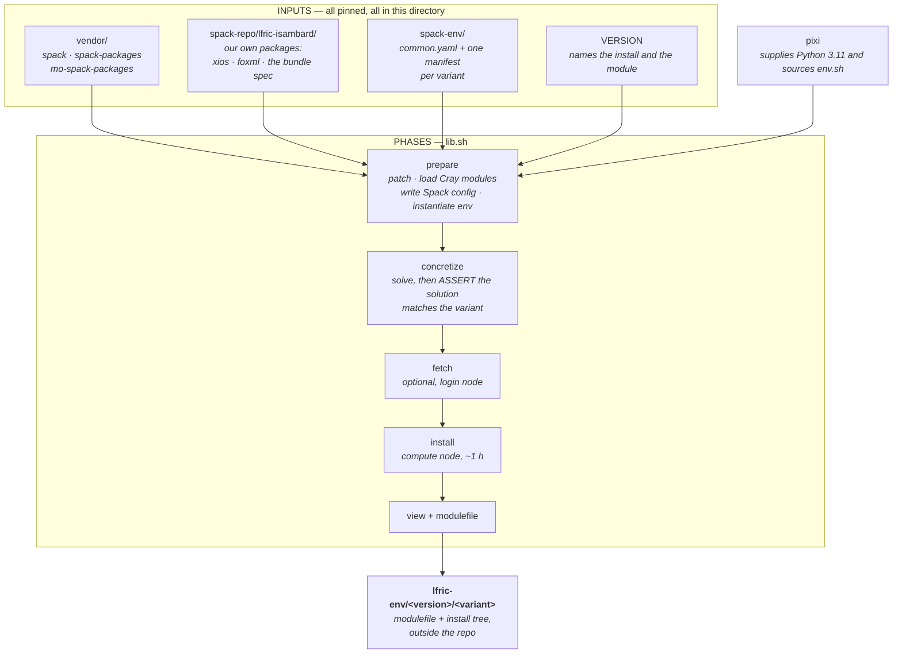
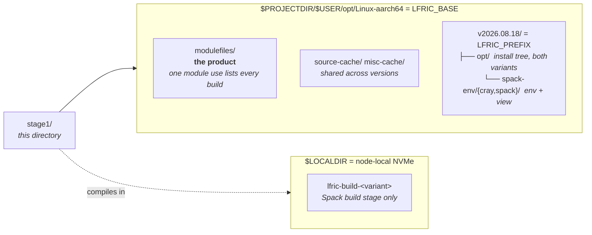

# Stage 1 — build the LFRic environment

This directory builds one thing: an **Lmod modulefile** that gives you a complete
LFRic Apps toolchain on Isambard 3.

```
module use $PROJECTDIR/$USER/opt/Linux-aarch64/modulefiles
module load lfric-env/v2026.08.18/cray
```

Those two lines are the entire product. Everything else in this repo — compiling
`lfric_atm`, running science suites — consumes them and needs nothing else from
here: not this directory, not pixi, not Spack. That separation is the point, and
it is why Stage 1 can use whatever tooling it likes.

---

## 1. The mental model

Pinned sources plus a Spack solve produce an install tree; a generator turns
that install tree into a modulefile.



Three drivers each run a prefix of that chain, which is why they are three lines
long apiece:

| Run | Phases | Where | Cost |
|---|---|---|---|
| `pixi run concretize` | prepare, concretize | login node | ~1 min |
| `pixi run fetch` | prepare, concretize, fetch | login node | ~20 min |
| `pixi run build` | prepare, concretize, install, modulefile | **compute node** | ~1 h |

Concretize is the one you run often. It is the cheap check that a change to
`spack-env/` or `spack-repo/` still solves, and it runs the variant assertions —
so it catches the whole "this built fine but is subtly the wrong stack" class of
failure before you spend a node on it.

---

## 2. Where everything lands

Nothing is written inside this repo, and nothing is written to `$HOME` — not
even `~/.spack`, which is redirected. Three locations, chosen for three
different reasons:



* **`LFRIC_BASE`** is per-architecture and **shared across environment
  versions**. The modulefiles live here, so one `module use` makes
  `module avail lfric-env` list every version and variant side by side. So do
  the download caches, which are content-addressed — a new version reuses
  sources previous versions already fetched, instead of re-hitting a flaky host.
* **`LFRIC_PREFIX`** = `$LFRIC_BASE/$(cat VERSION)` is per-version and
  persistent. Bumping `VERSION` means the next build lands in a *fresh* tree
  rather than overwriting an environment somebody is loading right now. Both
  variants install into its `opt/`, but do not expect much sharing: measured on
  this build, only **43 of 187** specs (22%) have an identical hash across the
  two variants. Even python, boost, perl and the whole rose/cylc/psyclone stack
  rebuild, because the two environments are solved independently and a
  difference low in the graph re-hashes everything above it. Sharing one `opt/`
  is still right — it keeps one Spack database and one place to delete — but
  the second variant costs roughly a second full build, not a quick increment.
* **`LFRIC_WORKING_DIR`** is transient and disposable. It is on node-local NVMe
  because compiling is metadata-heavy and doing it on contended Lustre makes the
  install phase crawl.

`env.sh` derives all three, and `pixi run where` prints them. Read `env.sh` if
you want to know where anything goes: it is the entire configuration surface,
and nothing in Stage 1 infers a path anywhere else.

---

## 3. Prerequisites

* **pixi** on `PATH` (login *and* compute nodes; `$HOME` is shared, so one
  install covers both).
* **`PROJECTDIR`, `LOCALDIR`, `USER`** set — Isambard 3's default login
  environment provides all three. `env.sh` checks them and refuses to guess.
* **An SSH key authorized for Met Office SSO.** One of the three submodules,
  `mo-spack-packages`, is private. The other two clone anonymously over HTTPS.
  A failing `pixi run submodules` is almost always this.

---

## 4. Build it

Run these in order, from this directory. This is the whole procedure.

```bash
cd stage1

# --- one-time: the pinned Spack + package repos -----------------------------
pixi run submodules

# --- login node: check the solve, then warm the source cache ----------------
pixi run concretize           # -> CONCRETIZE_OK      (~1 min)
pixi run concretize-spack     # -> CONCRETIZE_OK      the portable variant
pixi run fetch                # -> FETCH_OK           (~20 min; optional)

# --- compute node: the build ------------------------------------------------
sbatch build.sbatch                                    # -> BUILD_OK, ~1 h
tail -f logs/build-<jobid>.out

# --- the result: this is all Stage 2 ever needs -----------------------------
module use "$PROJECTDIR/$USER/opt/Linux-aarch64/modulefiles"
module load lfric-env/"$(cat VERSION)"/cray

rose --version                # all three come from the module, nothing else
cylc --version                # 8.4.2
psyclone --version            # 3.3.1 (pinned in the bundle spec)
echo "$FC $CXX $LDMPI"        # ftn CC ftn
$FC --version                 # GNU Fortran 14.3.0, via the Cray wrapper
```

`pixi run where` prints those paths for your account, and says whether the build
already exists.

To also build the portable variant (see §6), repeat the last step with
`sbatch --export=ALL,LFRIC_STACK=spack build.sbatch`. Budget *longer* than the
first, not shorter — it measured 1 h 53 m against cray's 1 h 08 m, because it
builds MPI, HDF5 and netCDF from source and shares far less with the first
variant than their common dependency list suggests (see §2). Chain it with
`--dependency=afterok:<jobid>` rather than running the two concurrently: they
write to one install tree.

Measured on 2026-08-18: **1 h 08 m** on 24 cores with a warm source cache, peak
RSS 8 GB. Expect longer the first time on a machine, when `fetch` has nothing
cached and the sources are still being downloaded. The job asks for 6 h because
`rust` and `xios` are deliberately built at a capped `-j` (`lfric_install` in
`lib.sh`) and the headroom is free.

Re-running the build is safe and cheap — Spack skips what is already installed —
so the fix for an interrupted or failed build is normally to submit it again.

---

## 5. What each file is

```
stage1/
├── env.sh              ALL configuration. Sourced by pixi before every task,
│                       and again by each driver. Read this first.
├── pixi.toml           the task list; each task is a one-line wrapper
├── VERSION             the environment's version (CalVer). Edit to bump.
│
├── lib.sh              the build phases, as lfric_* functions
├── concretize.sh       solve only          } thin drivers: each is an ordered
├── fetch.sh            solve + download    } list of phases from lib.sh
├── build.sh            the full build      }
├── build.sbatch        how to run build.sh on a compute node
├── where.sh            print the resolved paths and whether it is built
│
├── gen-modulefile.sh   writes the modulefile's DATA half (per-build paths)
├── lfric-env.lua       the modulefile's LOGIC half — what `module load` does.
│                       Version-controlled and reviewable; snapshotted next to
│                       the generated modulefiles so loading needs no repo.
│
├── spack-env/          the Spack manifests: common.yaml (repos, the gcc
│                       external, python) + one per variant (MPI and parallel
│                       I/O). Templates — instantiated under LFRIC_PREFIX.
├── spack-repo/         our own Spack packages: xios (pinned commit), foxml,
│                       and lfric-apps-isambard, the has_code=False bundle spec
│                       that names every dependency of the environment.
├── patches/            applied to the vendored trees before every phase, so
│                       there is no "forgot to patch" state. One patch: gdbm
│                       1.26 ships mismatched autotools timestamps.
└── vendor/             pinned submodules — spack, spack-packages (the builtin
                        package repo), mo-spack-packages (Met Office; private).
```

Two files deserve the extra attention, because they are where the design lives:

**`env.sh`** exists so that nothing else has to compute a path. pixi sources it
at activation, and each driver sources it again — which is what makes
`LFRIC_STACK=spack bash build.sh` re-derive every variant-dependent path instead
of inheriting the default's. Only a handful of variables read an existing value
(they are marked); the rest are unconditional, which is what keeps that
double-sourcing honest.

**`lfric-env.lua`** is the contract. It sets the toolchain and where to find the
environment, and deliberately nothing else — in particular not `APPS_ROOT_DIR`
or `CORE_ROOT_DIR`. Those name a *source tree*, which belongs to whoever is
building. The header comment records what setting them from a module cost a user
once; the short version is that cylc runs a task's `pre-script` after its
`[[[environment]]]` block, so a module loaded there silently overrode the suite's
own sources. Keep this module additive.

---

## 6. The two variants

`LFRIC_STACK` selects what satisfies MPI and parallel I/O. Both are Spack
environments; they differ only in what is external.

| | `cray` (default) | `spack` |
|---|---|---|
| MPI | system cray-mpich + system libfabric (`cxi`) | from-source mpich, `ch4:ofi`, no `cxi` |
| Parallel I/O | Cray HDF5/netCDF externals | from source |
| Launcher | `srun` | Hydra `mpiexec` (built `~slurm`) |
| Use it for | **everything** | nothing real |

**Run everything on `cray`.** It is the only one with working multi-node MPI
here: Slingshot RDMA through the `cxi` provider, and `srun` able to PMI-launch
it. The `spack` variant falls back to TCP between nodes and cannot be launched
by `srun` at all, so it is single-node at best.

It is still worth keeping green. It is the build invariant — **both variants
must concretize and build** — and what it actually tests is that the cray
variant's dependency on the Cray PE is confined to the places we put it. A
change that quietly makes the Cray PE load-bearing somewhere new shows up as the
`spack` variant failing, and nowhere else.

That is what the assertions in `lfric_assert_variant` are for: after each solve
they grep `spack.lock` and fail if a from-source MPI appeared in the cray solve,
or a Cray external in the spack one. Without them, a `PrgEnv` leaking into the
environment produces a build that installs perfectly and then has no working
multi-node MPI. Keep them.

---

## 7. Common changes

**Bump the version.** Edit `VERSION`, then rebuild. The next build lands in a
fresh prefix and a fresh module; the old one keeps working for anyone loading
it. Do this whenever the built environment would differ in a way someone might
need to pin against.

**Change what is in the environment.** Edit the `depends_on` list in
`spack-repo/lfric-isambard/packages/lfric-apps-isambard/package.py`, then
`pixi run concretize` (both variants) before building. That package builds
nothing — it is purely the list of what the environment contains.

**Bump the Cray libraries.** The module versions in `lib.sh`
(`HDF5_MODULE`, `NETCDF_MODULE`) and the external prefixes in
`spack-env/cray/spack.yaml` describe the same thing and **must** be changed
together. `spack-env/spack/spack.yaml` pins the same versions from source, so
the two variants stay comparable — bump that too. `pixi run concretize` catches
a mismatch immediately: an external that no longer resolves silently becomes a
from-source build, and the assertion fires.

**Change what `module load` does.** Edit `lfric-env.lua`, then
`pixi run modulefile` to regenerate without rebuilding. For the `cray` variant
that needs the Cray PE modules loaded (it reads `CRAY_LD_LIBRARY_PATH`), so
unless you know why you are not, just re-run `build` — it is incremental and
loads them itself.

**Revert the patches.** `git -C vendor/spack-packages checkout .`. They are
re-applied on the next phase; they are idempotent.

**Update a submodule pin.** `git -C vendor/<name> checkout <ref>`, then commit
the gitlink here. Re-concretize both variants afterwards.

---

## 8. Where the pinned versions come from

The versions in `lfric-apps-isambard/package.py` are not free choices. They are
dictated upstream, and after any bump of the LFRic sources you re-derive them
from these, in priority order:

1. **`lfric_core/documentation/source/getting_started/installation/software_dependencies.rst`**
   — the Met Office reference software stack for a release: Python, HDF5, netCDF,
   mpich, PSyclone, fparser, YAXT, XIOS, blitz, rose-picker, Rose/Cylc, pFUnit.
   This is the list our bundle spec should track. It is per-release prose and
   **can lag the tag** — cross-check it against 2 and 3.
2. **`lfric_apps/rose-stem/site/*/common/suite_config_*.cylc`** — the module
   versions the Met Office actually loads in CI. A reality check on the prose.
   The `meto` entries load opaque site modules (`lfric/vn3.2`), so for library
   versions the other sites are the informative ones.
3. **The optimisation scripts themselves** (`applications/*/optimisation/*/psykal/`
   in apps, `infrastructure/build/psyclone/psyclone_tools.py` in core) — the
   *executable* statement of which PSyclone API is required, and the one that
   settles disagreements. `psyclone_tools.py` guards moved imports with
   `try/except`; the apps-side scripts do not. At 2026.07.1 the `.rst` still said
   PSyclone 3.2.2 while `lfric_atm/optimisation/meto-ex1a/psykal/algorithm/
   casim_alg_mod.py` did a bare `from psyclone.psyir.transformations import
   OMPParallelTrans`, which exists only from 3.3 — which is why the pin is 3.3.1.
   **Grep the optimisation scripts for `from psyclone` after every apps bump.**

**XIOS is the highest-risk single bump in the stack — read this before touching
it.** `xios@2701` is what current LFRic wants (the core docs and the MetO CI
configs both say XIOS2 r2701, and `mo-spack-packages` ships `xios@2.2701` at the
same commit; it also ships `xios@3.0.4.0` if a move to XIOS 3 is ever wanted). We
build r2701 from the migrated Git history: former SVN r2701 is git `2eb572f0` on
the `XIOS2` branch. That commit restores most of the STL includes older revisions
lacked, but `earcut.hpp` *still* comments out `<tuple>`/`<cstddef>` while using
`std::tuple_element`/`std::get`/`std::size_t`, which current libstdc++ no longer
exposes transitively — hence the minimal `gcc_remap_standard_headers.patch`
(`when @2701`) that uncomments them. Bumping XIOS therefore means: add the new
revision and commit to `spack-repo/lfric-isambard/packages/xios/package.py`;
**regenerate** the header patch from the new checkout rather than assuming it
still applies (the `earcut.hpp` context drifts between revisions); then confirm
lfric still links against it.

**The compiler** is an explicit external in `spack-env/common.yaml`
(`gcc@14.3.0` → `/usr/bin/{gcc,g++,gfortran}-14`) with per-language `require`s.
The build deliberately never runs `spack compiler find`, which would rewrite the
manifest and could drift to a stray gcc. 14.3.0 is the newest complete
cray-native C/C++/Fortran toolchain on the system; to target another, edit the
external and the `require`s together.

## 9. Gotchas

**Never run a full build on a login node.** They cap you at ~900 processes
(`ulimit -u`) and the build forks past that, failing with `fork: Resource
temporarily unavailable`. Concretize and fetch are fine there.

**Spack 1.0 needs CPython in [3.7, 3.12).** It parses package sources with
`ast.Str`, which 3.12 removed. This is the single reason pixi is here — it pins
3.11. (The environment being built contains its own Python 3.12; unrelated.)

**Compute nodes have outbound network**, so `fetch` is an optimisation, not a
requirement. Do it anyway: it moves the risk of a third-party host being down
off your allocated node time. `gitlab.in2p3.fr`, which serves the XIOS clone, is
the one that actually fails.

**If pixi errors with a missing file** while installing its own environment,
check where its cache is (`echo $PIXI_CACHE_DIR`). If that resolves onto a
purged filesystem such as `/scratch`, the purge leaves cached packages as
skeletons and pixi dies copying a file that is no longer there. Point it at
`$HOME`: `export PIXI_CACHE_DIR="$HOME/.cache/pixi"`.

**`GIT_EXTERNAL_DIFF=difft`** crashes on this system (`Unsupported system page
size`) and breaks anything that shells out to `git diff`. `unset` it.
